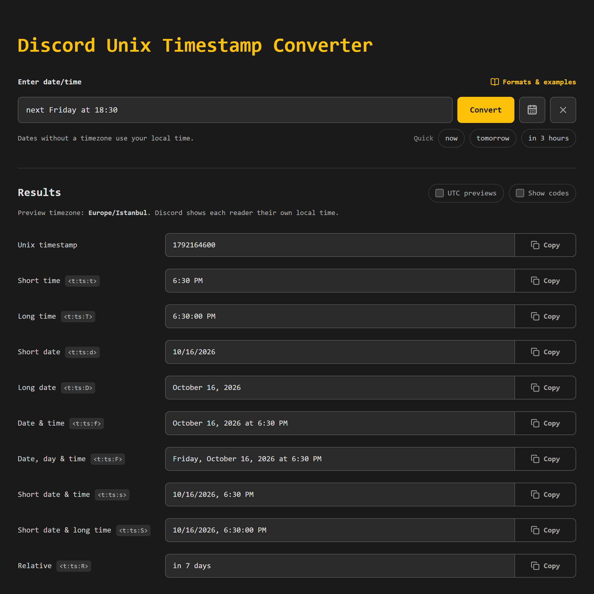

# Discord Unix Timestamp Converter

[](https://rhgx.github.io/timestamp-converter/)
[](.docs/)


Type a date the way you would say it, and get a Discord timestamp that shows up in every reader's own timezone and language.

**[Open the converter](https://rhgx.github.io/timestamp-converter/)**



## How to use it

1. Type a date or time, such as `tomorrow at 3pm` or `next Friday at noon UTC`. You can also pick one from the calendar button.
2. Press **Convert**.
3. Copy the format you want and paste it into a Discord message.

Discord replaces the pasted tag, such as `<t:1704122430:f>`, with the date in each reader's local time. Someone in Tokyo and someone in New York see the same moment, each in their own clock.

## What you can type

| Kind | Examples |
| --- | --- |
| Relative | `in 3 hours`, `in 1h 30m`, `two hours ago`, `in 3 days at noon` |
| Named days | `tomorrow at 3pm`, `3pm next Friday`, `tomorrow morning`, `tonight at 9`, `end of month` |
| Calendar dates | `Jan 1st 2027 at 3:00 PM`, `25 December at noon`, `15.01.2027 14:30` |
| With a place or timezone | `8pm in Mumbai`, `noon California`, `noon India time`, `noon Springfield, IL`, `2 PM EST`, `noon UTC+05:30` |
| Timestamps and tags | `1704067200`, `1704067200000ms`, `<t:1704067200:F>` |

As you type, the converter shows how it reads your text. Dates without a timezone use your local time. Slash dates are month first (`01/15/2027`); dotted dates are day first (`15.01.2027`).

In the app, **Formats & examples** lists every supported form with clickable examples and the most common mistakes. The full rules are in [input formats](.docs/input-formats.md).

## Discord formats

Examples are for `2024-01-01 15:20:30 UTC` in an en-US Discord client. Each reader sees their own language and timezone.

| Format | Paste this | Readers see |
| --- | --- | --- |
| Short time | `<t:1704122430:t>` | 3:20 PM |
| Long time | `<t:1704122430:T>` | 3:20:30 PM |
| Short date | `<t:1704122430:d>` | 01/01/2024 |
| Long date | `<t:1704122430:D>` | January 1, 2024 |
| Date & time | `<t:1704122430:f>` | January 1, 2024 at 3:20 PM |
| Date, day & time | `<t:1704122430:F>` | Monday, January 1, 2024 at 3:20 PM |
| Short date & time | `<t:1704122430:s>` | 01/01/2024, 3:20 PM |
| Short date & long time | `<t:1704122430:S>` | 01/01/2024, 3:20:30 PM |
| Relative | `<t:1704122430:R>` | 3 years ago (counts live) |

## Tips

- **Share a conversion.** The address bar keeps your input as `?q=`, so you can bookmark or send the link. Relative input such as `tomorrow` is worked out again when the link opens, so add a date or timezone when the link is for someone else.
- **Check another timezone.** Add it to the input (`3pm Pacific time`), or turn on **UTC previews** to see the results in UTC.
- **See exactly what gets copied.** **Show codes** swaps each preview for the tag you will paste.

## Run it locally

You need Node.js 22.12 or newer and pnpm.

```sh
pnpm install
pnpm dev
```

See [development](.docs/development.md) for tests, the project layout, and deployment.

## Documentation

- [Input formats](.docs/input-formats.md): everything the parser accepts, and how it resolves timezones, DST, and relative dates.
- [Interface](.docs/interface.md): how the dialogs, calendar, results, and links behave.
- [Development](.docs/development.md): setup, scripts, code layout, and conventions.

## Credits

Icons by [Lucide](https://lucide.dev/), text morphing by [Torph](https://torph.lochie.me/), the calendar grid by [React Datepicker](https://reactdatepicker.com/), and place names by [city-timezones](https://github.com/kevinroberts/city-timezones).
